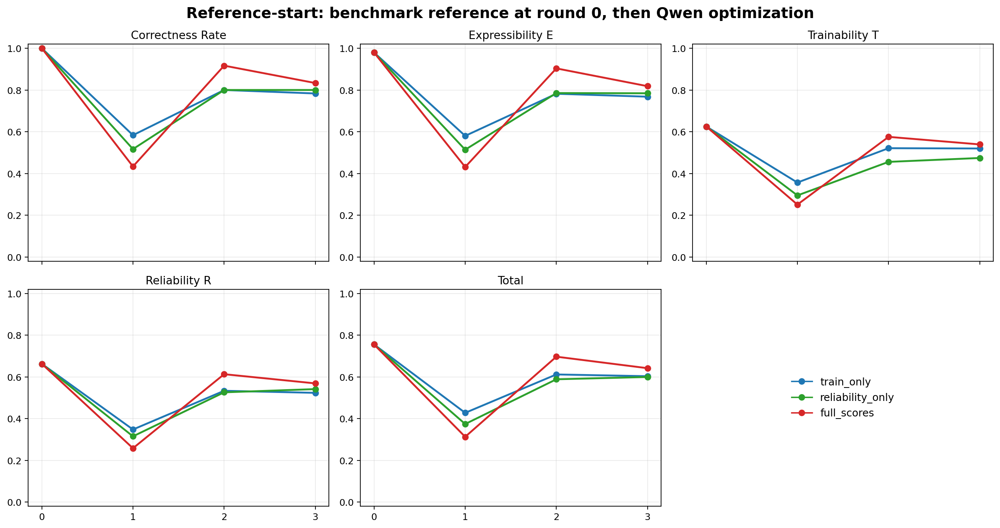
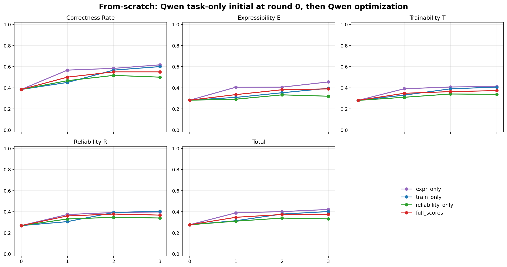

# QChem Ansatz Experiment Viewer

This static viewer compares two Qwen3-Coder ansatz-generation settings on the same 60 stratified PennyLane/qchem tasks.

- Open the viewer: [index.html](index.html)
- Reference-start chart: [assets/reference_start_metric_trends.png](assets/reference_start_metric_trends.png)
- From-scratch chart: [assets/from_scratch_metric_trends.png](assets/from_scratch_metric_trends.png)
- Raw prompts: [raw_prompts/](raw_prompts/)

Each task page links every Qwen round to the exact prompt text used for that request.

## Experiment Setup

- Dataset: PennyLane/qchem local benchmark tasks.
- Task count: 60.
- Sampling: stratified by molecule, basis, qubit count, and bond length.
- Max qubits: 12.
- Model: `qwen3-coder-next-fp8`.
- Rounds: 3 feedback rounds.
- Regimes:
  - `expr_only`
  - `train_only`
  - `reliability_only`
  - `full_scores`
- Expressibility samples: `ANSATZ_EXPR_SAMPLES=102`.
- Trainability mapping:
  - `ANSATZ_TRAIN_LOG_MIN=-4`
  - `ANSATZ_TRAIN_LOG_MAX=0`

## Prompt Conditions

### Reference-Start

Round 0 is the benchmark/reference ansatz candidate. The feedback prompt gives Qwen:

- the task prompt;
- metric definitions for correctness, E, T, R, and Total;
- the full benchmark/reference Qiskit circuit code;
- visible score feedback according to the active regime.

Round 2 and later append all previous Qwen candidates for that task, including their visible feedback and code.

### From-Scratch

Initial generation receives only the task prompt. No reference circuit is shown.

Feedback rounds then optimize the Qwen-generated round-0 candidate and append all previous Qwen candidates for that task.

## Aggregate Metric Trends

### Reference-Start



### From-Scratch



## Correctness

E/T/R are computed only after correctness passes. A circuit is correct if it:

- uses exactly the task qubit count;
- has no classical bits and no measurements;
- has parameter count within task limits;
- does not exceed task max depth;
- uses only allowed gates;
- has finite Hamiltonian energy at the all-zero parameter vector.

If correctness fails:

```text
E = 0
T = 0
R = 0
Total = 0
```

## Expressibility E

The implementation samples `N_E = 102` random parameter vectors:

```text
theta_k ~ Uniform([-pi, pi]^p)
```

For all unordered state pairs:

```text
F_ij = |<psi(theta_i)|psi(theta_j)>|^2
```

With 102 samples:

```text
102 * 101 / 2 = 5151 fidelities
```

The fidelities are histogrammed into 50 uniform bins over `[0, 1]`.

For an `n`-qubit circuit:

```text
d = 2^n
```

The Haar bin mass for bin `[a, b]` is implemented as:

```text
P_Haar([a,b]) = (1 - a)^(d - 1) - (1 - b)^(d - 1)
```

Both empirical and Haar histograms use `+1e-12` smoothing and normalization.

```text
D_KL = sum_b P_emp(b) * log(P_emp(b) / P_Haar(b))
E = exp(-D_KL)
```

Higher is better.

## Trainability T

T is a Hamiltonian-energy gradient-variance barren-plateau proxy.

Energy:

```text
L(theta) = <psi(theta)|H|psi(theta)>
```

The evaluator samples random parameter vectors. It checks up to 24 parameters. For parameter index `m`, it uses the parameter-shift gradient:

```text
g_{k,m} = 0.5 * (L(theta_k + (pi/2)e_m) - L(theta_k - (pi/2)e_m))
```

Then:

```text
gradient_variance = Var({g_{k,m}})
logv = log10(gradient_variance + 1e-16)
```

This run uses:

```text
log_min = -4
log_max = 0
```

Score:

```text
T = clip((logv - log_min) / (log_max - log_min), 0, 1)
  = clip((log10(gradient_variance + 1e-16) + 4) / 4, 0, 1)
```

Higher is better.

## Reliability R

The circuit is transpiled with:

```text
basis_gates = ["rz", "sx", "x", "cx"]
coupling_map = line coupling over n qubits
optimization_level = 1
```

If transpilation succeeds, gate counts are taken from the transpiled circuit. Otherwise, counts fall back to the original circuit.

One-qubit gates counted:

```text
{"rz", "sx", "x", "z", "h", "s", "sdg", "rx", "ry", "u", "u3"}
```

Two-qubit gates counted:

```text
{"cx", "cz"}
```

With:

```text
p1 = 1e-3
p2 = 1e-2
G1 = one_qubit_gate_count
G2 = two_qubit_gate_count
```

Reliability:

```text
R = (1 - p1)^G1 * (1 - p2)^G2
  = 0.999^G1 * 0.99^G2
```

Higher is better.

## Total

For correct candidates:

```text
Total = (E + T + R) / 3
```

For incorrect candidates:

```text
Total = 0
```

## Viewer Contents

The viewer contains:

- 60 task detail pages;
- task prompt and metadata;
- reference-start trajectory;
- from-scratch trajectory;
- Qwen code for every round;
- correctness and E/T/R/Total for every candidate;
- rendered Qiskit circuit diagrams using `circuit.draw(output="mpl")`.
